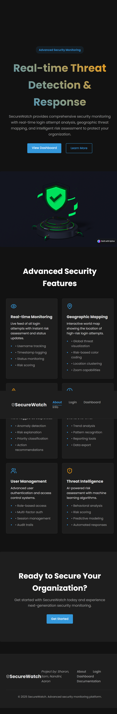
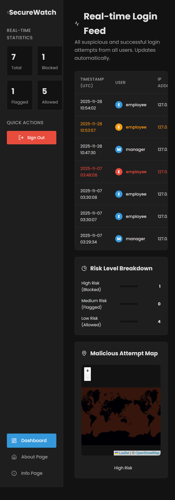

# SecureWatch





## ⚙️ Installation & Setup

The following commands assume you have **Python 3.8+** installed.

### **1. Clone the Repository**

```bash
git clone https://github.com/Sam-Manoj/SecureWatch.git
cd SecureWatch
```

### **2. Create a Virtual Environment**

#### **Windows**

```bash
python -m venv venv
venv\Scripts\activate
```

#### **Mac/Linux**

```bash
python3 -m venv venv
source venv/bin/activate
```

After activating the venv your terminal should show `(venv)`.

---

### **3. Install Dependencies**

```bash
pip install -r requirements.txt
```

Ensure your `requirements.txt` includes:

* Flask
* Flask-SocketIO
* SQLAlchemy
* pgmpy
* pandas
* scikit-learn

---

### **4. Generate Training Data**

You may let the app auto-generate the dataset on first run **or** generate it manually:

```bash
python pgm_model.py
```

This will create:

```
synthetic_dataset_for_training.csv
```

---

### **5. Run the Application**

```bash
python app.py
```

Your app will start at:
👉 **[http://127.0.0.1:5000](http://127.0.0.1:5000)**

---

## 🧪 Testing the Risk Logic

Below are scenarios using the built-in test accounts.

### 🟢 **Low Risk (Trusted)**

1. Open an **Incognito** window.
2. Log in with:

   * **Username:** employee
   * **Password:** employee123

✔️ You should see a **green entry** with **Risk 10**.

---

### 🟡 **Medium Risk (Flagged)**

1. Attempt login with wrong password (**1st failure**).
2. Attempt again (**2nd failure**).
3. Now log in with the correct password (**3rd attempt successful**).

✔️ You should see a **yellow entry** with **Risk 50**.

---

### 🔴 **High Risk (Blocked)**

1. Attempt login (wrong password) — **1st failure**.
2. Attempt login again — **2nd failure**.
3. Attempt login again — **3rd failure**.

✔️ A **red entry** appears with **Risk 99**.
✔️ A **pin drops on the geolocation map** showing attacker IP.

---

## 👥 Project Contributors

* **Sharon**
* **Sam**
* **Nandini**
* **Aaron**
